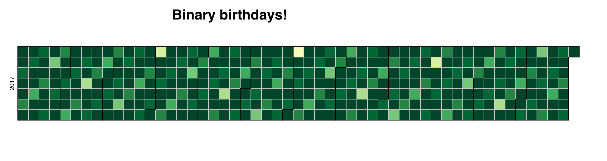

Binary Birthdays
===

>  Calendar heatmap showing how many passes of a binary search needed to guess a given birthday

Lighter colors are fewer passes. Darker colors require more. Minimum passes is 0, which is the case for July 2nd. The max is 9 passes.

### [View demo](https://mhkeller.github.io/binary-birthdays)
